<h1 align="center">
    sn0w-scripts
</h1>

This extension contains a collection of nodes and improvements created for lora management and general quality of life.

# Get Started

## Install

1. Install [ComfyUi](https://github.com/comfyanonymous/ComfyUI).
2. Clone this repo into `custom_nodes`:
    ```
    git clone https://github.com/sn0w12/ComfyUI-Sn0w-Scripts
    ```
3. Start up ComfyUI.

# Configuration

In the ComfyUI settings, you can modify various settings. Some changes will apply immediately, while others require a refresh to take effect.

## Settings

| Setting      | Definition |
| ----------- | ----------- |
| Animagine Prompt Style      | Places "1girl/1boy" at the beginning of your prompts in the "Prompt Combine" node.      |
| Custom Lora Loaders SD...   | Allows creation of new LoRa loaders by specifying their name and path.        |
| Custom Textbox Colors   | Sets the highlight color for text in textboxes.        |
| Disable Default Characters   | Disables the loading of the default characters in the "Character Selector" node.        |
| Highlight Favourite Items   | Highlights favorite LoRas and characters in green.        |
| Logging Level   | Sets the severity level of logs that will be printed.        |
| Max Difference in Lora Loading   | Specifies the maximum allowable difference between a tag and a LoRa for it to be loaded.        |
| Random Characters from Favourites Only   | Ensures random characters are selected only from your favorited characters.        |
| Sort Characters By Series   | Sorts characters by their series instead of alphabetically.        |

## Important Note
The custom lora loaders require these paths to be in your `extra_model_paths.yaml` (with your real directories of course). You only need to add the ones you are actively using.

```yaml
loras:
    base_path: D:/Ai/Lora/loras

    loras_15: /1.5 # SD1.5
    loras_xl: /XL # SDXL
    loras_3: /3 # SD3
```

# Major Features

## Lora Management

A major focus for me was making loras more manageable by letting users create their own lora loaders with specific folder paths and automatically loading loras based on tags. This makes browsing through your Loras much easier, though it may limit which Loras you can use depending on your configuration. You can configure custom Lora loaders in the ComfyUI settings with the following format:
```
ExampleName1:Value1
```

To create a Lora stack, add a number to the end:
```
Styles XL:style:2
```
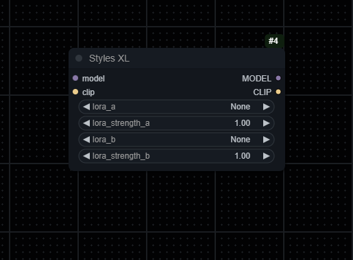

### Favourite Loras & Characters

The custom Lora loaders and the character selector feature allow you to mark Loras and characters as favorites, placing them at the top of the loaders for easy access. Favorite Loras are accessible across all your custom Lora loaders and the standard Lora loader, although the standard loader does not sort them correctly.

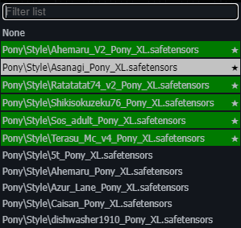

## Text Highlighting

Text in the copy/paste textbox will be highlighted when the text is in parentheses. You can change the colors of the highlighting by changing the `[Sn0w] Custom Textbox Colors` setting, there should be one either rgb `rgb(0, 0, 0)` or hex `#000000` color per line.

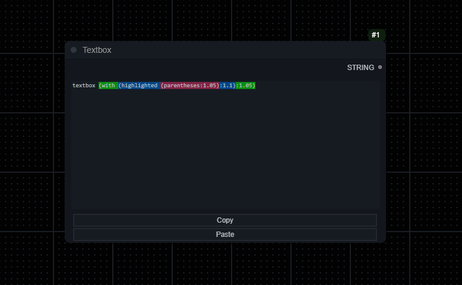

If you have unclosed parentheses it will be highlighted in red.

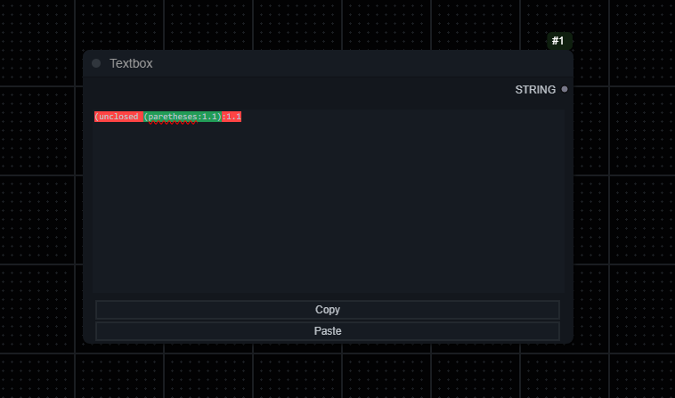

## Custom Schedulers

You can write your own custom scheduler in `src/custom_schedulers` and they will be added as a custom node, just make sure to follow the example in `get_sigmas_sigmoid.py`

### Sigmoid Scheduler

A custom scheduler that generally produces similar quality results as most other schedulers in my testing. However it works very poorly at low steps which may be an issue for some. Mostly written as an example for custom schedulers.

#### Sigmoid vs Align your steps

> <details>
>    <summary><i>Comparisons</i></summary>
>    Images generated at 20 steps, 8 cfg, 1152 x 896, no upscaling.<br> Sigmoid settings at 20 sigma max, 0 sigma min, 3.5 steepness and 0.8 midpoint ratio.
>
>```
>(score_9, score_8_up, score_7_up, score_6_up, source_anime, BREAK:1.1), 1girl, lips, long hair, grey eyes, black coat, medium breasts, cowboy shot, black robe, gold jewelry, looking at viewer, simple background, solo, white background, closed mouth, arms behind back, (red hair, dress, long dress, robe, white dress, gold trim:1.1)
>```
>    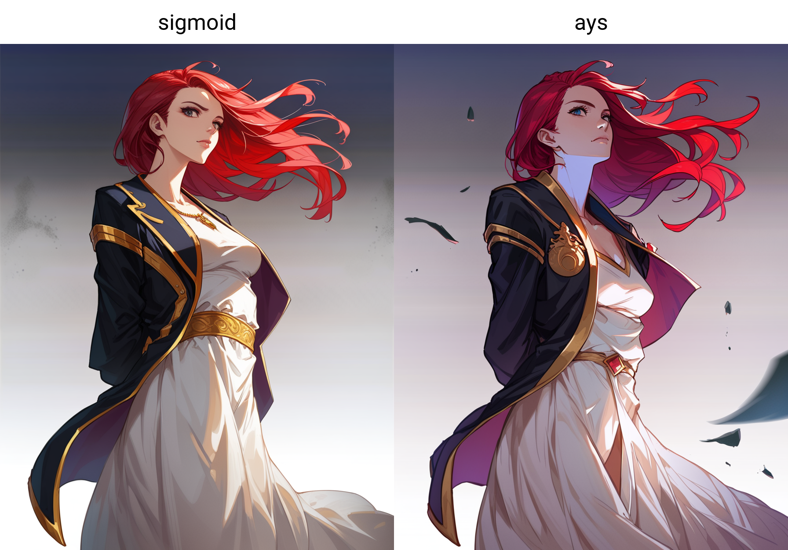
>    ```
>(power \(chainsaw man\), chainsaw man:1.1), blonde hair, cross-shaped pupils, demon girl, demon horns, double-parted bangs, hair between eyes, long hair, red horns, symbol-shaped pupils, yellow eyes, 1girl, black necktie, black pants, collared shirt, double v, looking at viewer, necktie, orange eyes, pants, parted lips, red background, red jacket, sharp teeth, shirt partially tucked in, shirt tucked in, simple background, sleeves past wrists, smile, solo, teeth, v, white shirt, (score_9, score_8_up, score_7_up, score_6_up, source_anime, BREAK:1.1)
>```
>    
>    ```
>(score_9, score_8_up, score_7_up, score_6_up, source_anime, BREAK:1.1), (makima \(chainsaw man\), chainsaw man:1.1), hair between eyes, long hair, medium breasts, red hair, ringed eyes, yellow eyes, 1836547, 1girl, @ \(symbol\), black necktie, braided ponytail, business suit, collared shirt, formal, light smile, looking at viewer, necktie, office lady, sidelocks, simple background, smile, solo, suit, white shirt
>```
>    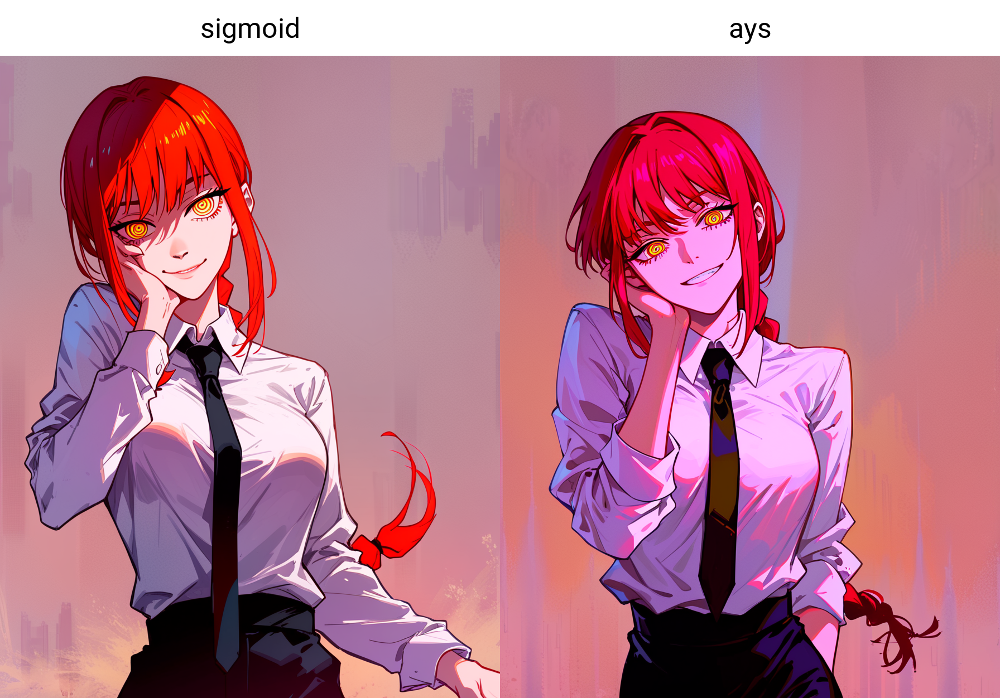
>    ```
>(score_9, score_8_up, score_7_up, score_6_up, source_anime, BREAK:1.1), (makima \(chainsaw man\), chainsaw man:1.1), hair between eyes, long hair, medium breasts, red hair, ringed eyes, yellow eyes, 1girl, black jacket, black necktie, black pants, black vest, closed eyes, collared shirt, formal, necktie, pants, shirt tucked in, simple background, sitting, solo, suit jacket, vest, white background, white shirt
>```
>    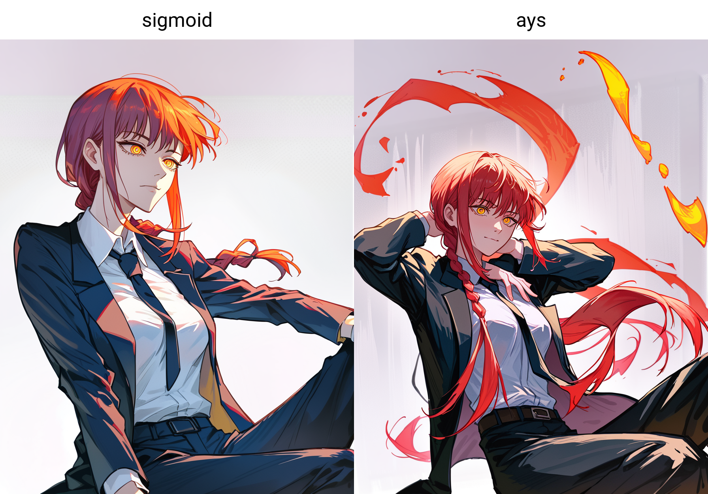
>    </details>

#### Sigmoid graph

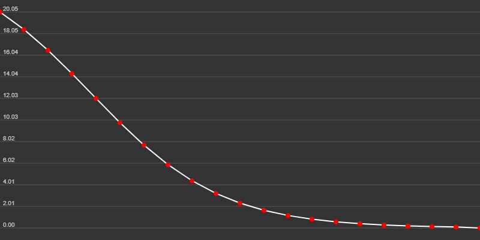

# Nodes

## Image Processing

Nodes that are specifically for generating and processing images.

### Simple Sampler Custom
> Ksampler with more settings and optional inputs. Support for custom schedulers
> <details>
>    <summary>ℹ️ <i>See More Information</i></summary>
>
>    - Can take both text and conditioning as positive and negative input.
>    - Can take a latent image or can generate one if none is provided.
>    - Supports schedulers such as align your steps, you can also create your own scheduler in `src/custom_schedulers/`, make sure to follow the example provided in `get_sigmas_sigmoid.py`.
>    - You can also just get the sigmas from any of the scheduler nodes and drag them into `sigmas (optional)`, if you do the scheduler widget will not be used.
>
>    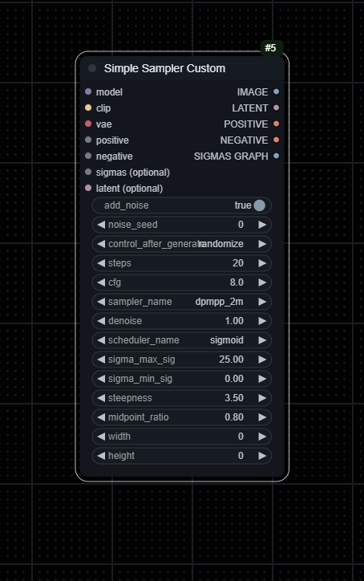
>    </details>

### Lora Tester
> Automatically generates X amount of images with provided loras.
> <details>
>    <summary>ℹ️ <i>See More Information</i></summary>
>
>    - I recommend making lora_info and add_default_generation inputs and using the outputs from the Lora Selector.
>    - Takes normal KSampler input but takes positive and negative inputs as text.
>    - Outputs a batch of images.
>
>    
>    </details>

## Lora Management

Nodes that handle lora selection, stacking, and loading.

### Load Lora Sn0w
> Normal load lora but can put favourite loras at the top of the list.
> <details>
>    <summary>ℹ️ <i>See More Information</i></summary>
>
>    
>    </details>

### Load Lora Folder
> Dynamically applies Lora models based on similarity to a provided prompt.
> <details>
>    <summary>ℹ️ <i>See More Information</i></summary>
>
>    - This node processes a given prompt to identify and apply the most similar Lora models of the tags found in the prompt.
>    - For each part of the prompt, the node calculates a distance between tags and available Lora model filenames. The max distance can be chosen in the settings.
>    - **Example folder input:** `*master_folder, subfolder1:3, -excludefolder, subfolder2`
>        - `*master_folder` specifies all paths must include `master_folder`.
>        - `subfolder1:3` indicates up to 3 models from `subfolder1` can be loaded.
>        - `-excludefolder` ensures any path containing `excludefolder` is ignored.
>        - `subfolder2` loads models from this subfolder without a numeric limit.
>    - Note: You need the loras separated into XL and 1.5 as stated in the `Important Note`.
>    - Note: Loras need to be named very similarly to the tag, with at most 5 characters different. Words in the lora filename can be separated by spaces or underscores.
>
>    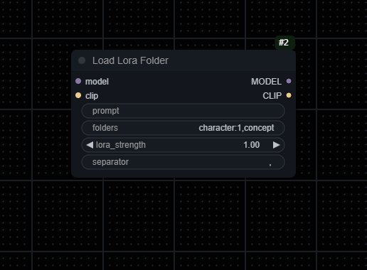
>    </details>

### Lora Selector
> Automatically selects X amount of loras between two numbers.
> <details>
>    <summary>ℹ️ <i>See More Information</i></summary>
>
>    - Loras have to be formatted like the default kohya_ss outputs. (lora_name-000001)
>    - Select the first lora.
>    - Select the number of the highest lora you want to test.
>    - Select the amount of loras you want to test.
>    - Outputs list of loras like this: \<lora:name:strength>
>    - Add default generation adds an extra "nothing" at the end of the list, used in Lora Tester to generate an image without the lora.
>
>    
>    </details>

### Lora Stacker
> Outputs a list of loras for Lora Tester. Does not load any loras by itself.
> <details>
>    <summary>ℹ️ <i>See More Information</i></summary>
>
>    - Basically Lora Selector but manual.
>    - Specifically for the lora testers.
>
>    
>    </details>

## Character and Text Processing
Nodes for selecting and combining character and textual elements.

### Character Selector
> Outputs a character name and prompt.
> <details>
>    <summary>ℹ️ <i>See More Information</i></summary>
>
>    - Loads `characters.json` and outputs prompt based on it.
>    - You can create a file named `custom_characters.json` and add characters there if you want, they will be loaded with all the other characters if you format it like the `characters.json` file.
>    - If `custom_characters.json` has a character with the same name as `characters.json` it will add the custom prompt at the end of the normal one, this can be useful if you have loras that need activation tags.
>
>    
>    </details>

### Prompt Combine
> Combines multiple strings with a specified separator and optionally simplifies the result by removing redundant or incompatible tags.
> <details>
>    <summary>ℹ️ <i>See More Information</i></summary>
>
>    - If simplify is enabled, the simplification process identifies and removes redundant tags (e.g., when a tag is fully encompassed by another, more descriptive tag) and tags incompatible with factors such as facing away, covered eyes, etc. Any tags that are in parentheses will not be removed.
>
>    
>    </details>

## Utility Nodes
Nodes that provide utility functions across the system.

### Get Font Size Node
> Estimates the optimal font size for text to fit within an image based on Lora information.
> <details>
>    <summary>ℹ️ <i>See More Information</i></summary>
>
>    - This node takes an image and a string, estimating the best font size to ensure that the longest piece of the string fits within the image. The approach considers the image's width and the length of the text to find a size that balances visibility and fit.
>
>    
>    </details>

### Copy/Paste Textbox
> A multiline textbox with copy, paste and highlighting functionality.
> <details>
>    <summary>ℹ️ <i>See More Information</i></summary>
>
>    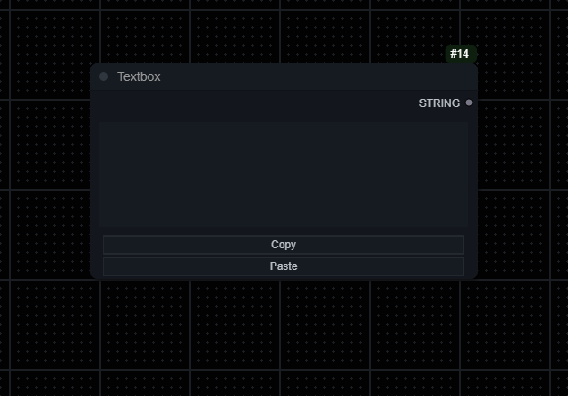
>    </details>

### Upscale Image With Model By
> Upscales an image by a certain amount with an upscale model.
> <details>
>    <summary>ℹ️ <i>See More Information</i></summary>
>
>    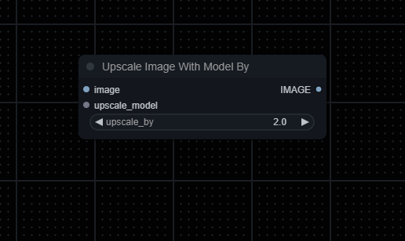
>    </details>

### Filter Tags
> Filters a string to only returns tags that have to do with a chosen category. // WIP
> <details>
>    <summary>ℹ️ <i>See More Information</i></summary>
>
>    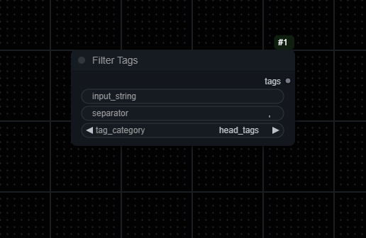
>    </details>
<br>

# Example Workflows
## Lora Tester
Note: Uses [ImagesGrid](https://github.com/LEv145/images-grid-comfy-plugin) for making the actual grid from the image output.


## T2I
My general text to image workflow, note that it uses several nodes from different custom nodes.

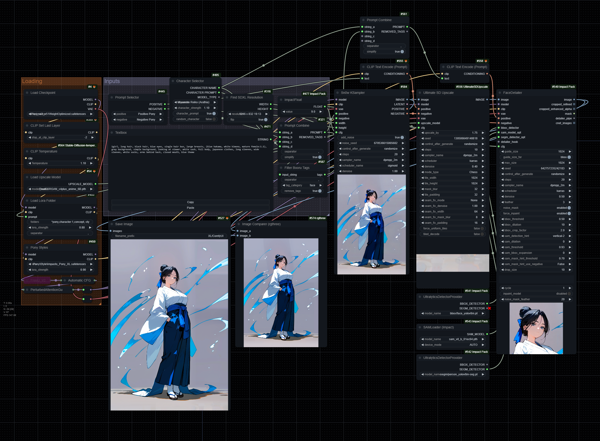
