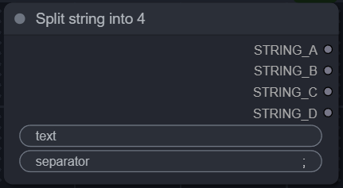

<h1 align="center">
    sn0w-scripts
</h1>

A collection of nodes and improvements created mainly for testing loras and general ease 

# Get Started

## Install

1. Install [ComfyUi](https://github.com/comfyanonymous/ComfyUI).
2. Clone this repo into `custom_nodes`:
    ```
    cd ComfyUI/custom_nodes
    git clone https://github.com/sn0w12/ComfyUI-Sn0w-Scripts
    ```
3. Start up ComfyUI.

# Nodes

## Find Resolution
> An easy way to select a width and height.
> <details>
>    <summary>ℹ️ <i>See More Information</i></summary>
>
>    - Enable flip if you want to swap the resolutions
>
>    
>    </details>

## Lora Selector
> Automatically selects X amount of loras between two numbers.
> <details>
>    <summary>ℹ️ <i>See More Information</i></summary>
>
>    - Loras have to be formatted like the default kohya_ss outputs. (lora_name-000001)
>    - Select the first lora.
>    - Select the number of the highest lora you want to test.
>    - Select the amount of loras you want to test.
>    - Outputs list of loras like this: \<lora:name:strength>
>    - Add default generation adds an extra "nothing" at the end of the list, used in Lora Tester to generate an image without the lora.
> 
>    
>    </details>

## Lora Tester (XL)
> Automatically generates X amount of images with provided loras.
> <details>
>    <summary>ℹ️ <i>See More Information</i></summary>
>
>    - I recommend making lora_info and add_default_generation inputs and using the outputs from the Lora Selector.
>    - Takes normal KSampler input but takes positive and negative inputs as text.
>    - Outputs a batch of images.
> 
>    
>    </details>

## Character Selector
> Outputs a character name and prompt.
> <details>
>    <summary>ℹ️ <i>See More Information</i></summary>
>
>    - Loads characters.json and outputs prompt based on it.
>    - Note: Currently very small list, feel free to add your own to the json file.
> 
>    
>    </details>

## Prompt Combine
> Combines 4 string to a single string.
> <details>
>    <summary>ℹ️ <i>See More Information</i></summary>
>
>    - Combines 4 strings into one with a seperator, but only adds the seperator of there isnt one already at the end of the string.
> 
>    
>    </details>

## Lora Stacker
> Outputs a list of loras for Lora Tester.
> <details>
>    <summary>ℹ️ <i>See More Information</i></summary>
>
>    - Basically Lora Selector but manual.
> 
>    
>    </details>

## Load Lora XL/1.5
> Normal load lora but from another folder.
> <details>
>    <summary>ℹ️ <i>See More Information</i></summary>
>
>    - Add these to your extra_model_paths.yaml (for example):
>    - loras_xl: C:/path/XL
>    - loras_15: C:/path/1.5
>    
>    
>    </details>

## Split String
> Splits a string into 4 parts.
> <details>
>    <summary>ℹ️ <i>See More Information</i></summary>
>
>    - Splits a string into 4 parts, not very useful.
>
>    
>    </details>

# Example Workflows